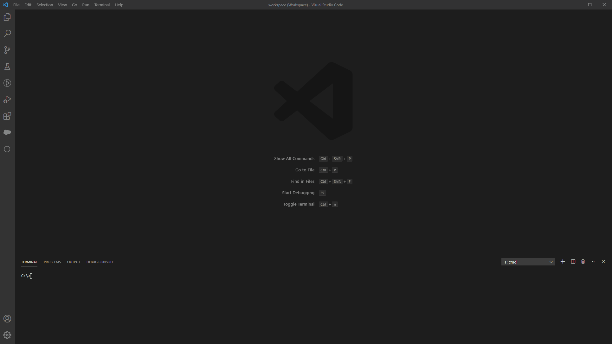

# SFDX MetaHelper

A Visual Studio Code extension for interact with Salesforce CLI. Just a simple helper to list metadata in Salesforce sandboxes using SFDX cli. It can generate a manifest package.xml with the metadata selected in order to retrieve afterwards using sfdx cli and it will suggest source or mdapi commands.

## Demo

## Requirements

It needs salesforce cli installed: https://developer.salesforce.com/tools/sfdxcli

## Technologies Used
* JavaScript
* [AngularJS](https://angularjs.org/)

## License

The code in this project is licensed under the MIT License. See [LICENSE](LICENSE) for details.

Note that you will be responsible for following terms of service of the third party APIs used in the code. 
